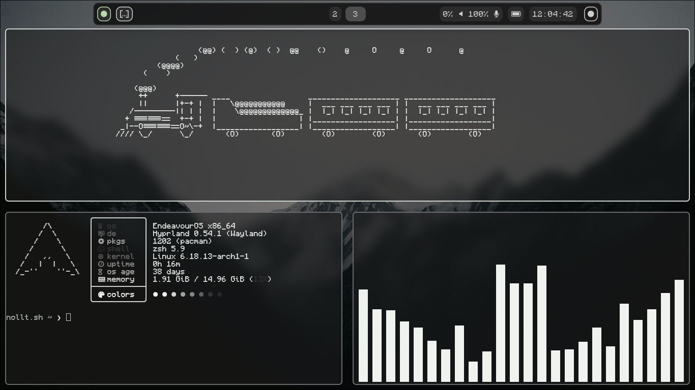
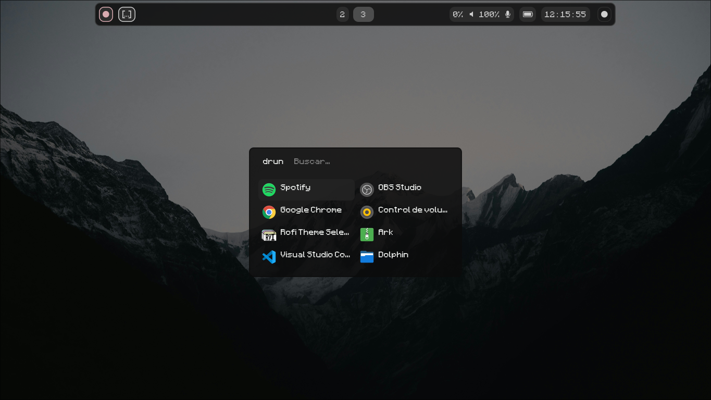
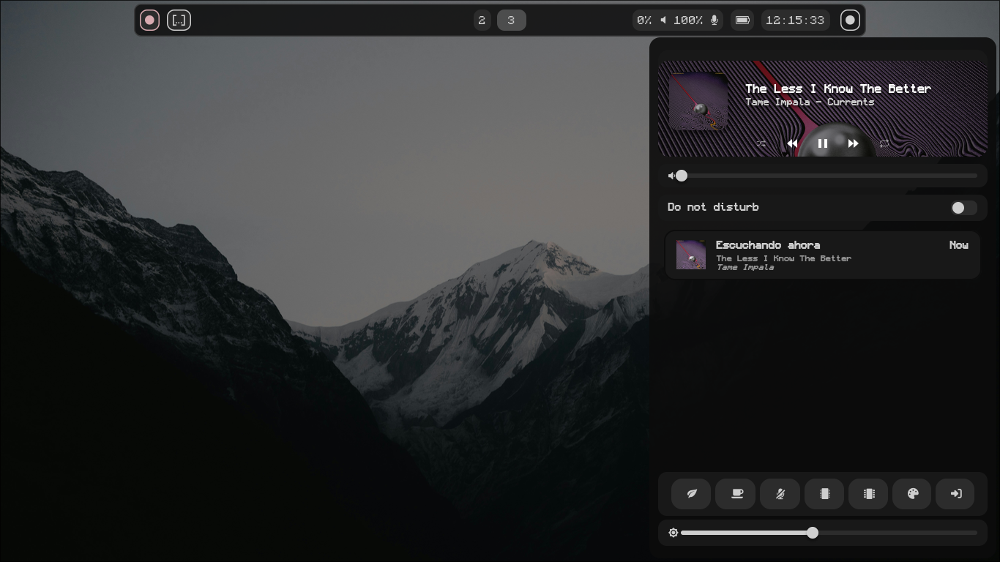

# darkB - Hyprland Dotfiles
---
## Previews






---

## Gestión de Temas (Symlinks)

​Este sistema utiliza un script personalizado en ~/.config/hypr/scripts/theme-menu.sh para alternar configuraciones.

​**Importante:** El script gestiona enlaces simbólicos para los archivos de configuración de:

**​Waybar:** Intercambia entre diferentes archivos CSS/JSON.

**​Rofi:** Cambia los colores del lanzador.

​**Wallpapers:** Actualiza el fondo mediante swww.

**SwayNC:** Intercambia entre diferentes archivos CSS/JSON.

---

## Componentes

Estos son los programas principales:

* **WM:** [Hyprland](https://hyprland.org/) (Wayland Compositor)
* **Barra:** `Waybar` (Configuración personalizada)
* **Terminal:** `Kitty`
* **Lanzador:** `Rofi` (Versión Wayland)
* **Fondo de Pantalla:** `swww`
* **Notificaciones:** `SwayNC`
* **System Fetch:** `Fastfetch`

---

1. **Clona el repositorio:**
   ```bash
   git clone https://github.com/L-Rush-C/darkB.git
   cd darkB
